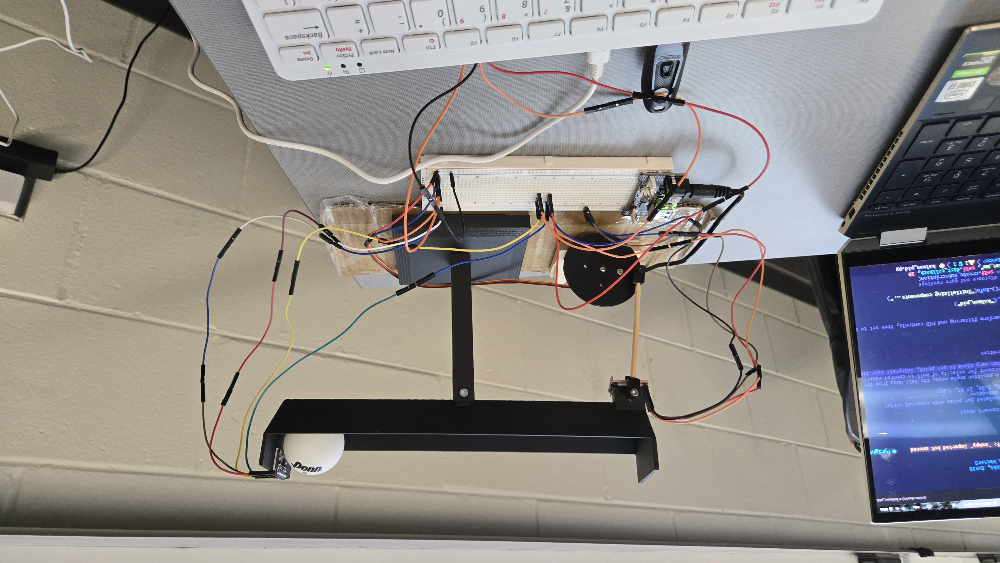
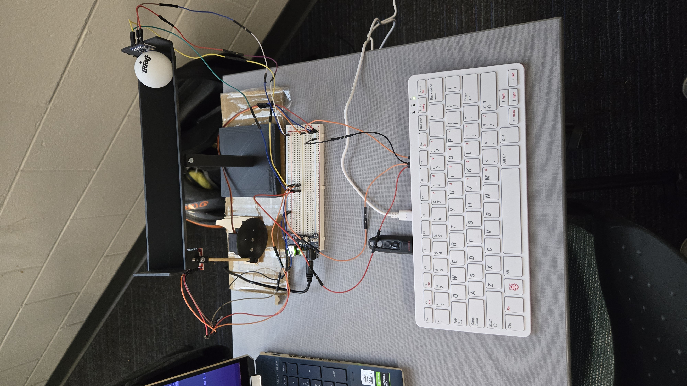
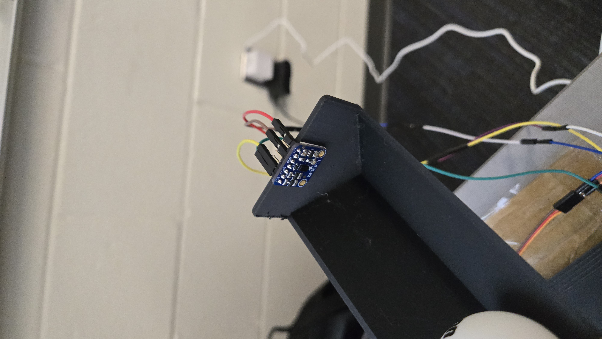
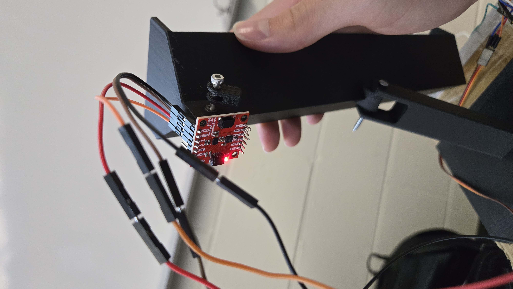
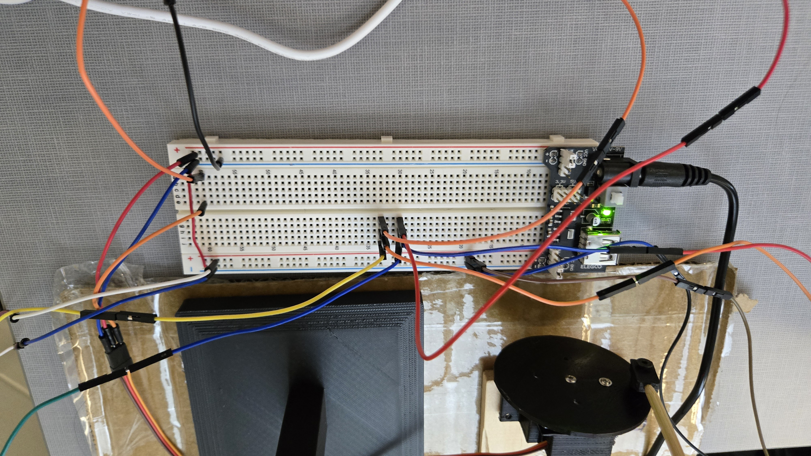

# The Thingamabob (AuRo Ball Balancer)
    
This github repo holds the code and various documentation scraps for our EEL4930/5934 Autonomous Robotics final project, a beam that can quickly and automatically balance a ball. Our team members are Paul Grau Jr, Quintin Lopez-Scarim, and Zachary Claussen.

Self link: https://github.com/Herschenglime/auro-balancer

## Video Link
https://youtu.be/n2TGsTVSxw0?si=552na6O2u0czWiuX

## Hardware Setup
Most of the components of the setup were 3D printed; they consisted of a base, a roughly 200mm-long track, a servo holder, a disc, and 2 interconnecting caps to transfer the force from the servo to one end of the track.

Other components included a flat strip of cardboard that the base and the servo holder were attached to with double-sided tape and a cut "barbecue stick" to transfer the torque from the motor into the end of the track for tilt. The servo also needed to be lifted a bit higher off of the cardboard for the disc to rotate properly, so it was affixed to a small piece of scrap wood. The ball that was balanced was a standard ping-pong ball, which simplified the dynamics of the system.

The main "brain" of our controller was a [Raspberry Pi 400](https://www.raspberrypi.com/products/raspberry-pi-400/) running ROS 24.04 (Jazzy Jalisco) on Ubuntu installed on a USB stick. 

To collect data about the state of the system, an [Adafruit VL53L0X distance sensor](https://learn.adafruit.com/adafruit-vl53l0x-micro-lidar-distance-sensor-breakout) was taped to the right of the track. For additional data, a [SparkFun IMU/Magnetometer unit](https://www.sparkfun.com/sparkfun-6dof-imu-breakout-ism330dhcx-qwiic.html#documentation) was taped under the left of the track so that the z axis aligned with the pillar on the base and the y axis pointed down the track. Both of these communicated with the Raspberry Pi over I2C, connected through a breadboard. 

A MG90S servo was used to move the rail. It was controlled by PWM from the RPi using the gpiozero and pigpio libraries. It was powered externally with 5V through an Elegoo power module connected to a 9V "wall wart." The power module also supplied 3.3V to the sensors. The grounds of the RPi and the power module were connected.

Everything was wired together using a small breadboard.

## ROS Structure
Each sensor/component had a separate ROS node to handle data and communication. Data from the IMU and distance sensor were published with `imu_publisher.py` and `dist_sensor.py` over the `dist_mm`, `gyro_dps`, and `accel_g` ROS topics. These were both subscribed to in the `kalman_pid.py` component, which maintained internal variables of the various parameters and updated them when new data was received. The PID algorithm ran on this node, and published a `servo_angle` message which was subscribed to by `servo_controller.py`, which translated the angle into PWM data to tell the servo to move.

The distance sensor was a little noisy, with a standard deviation of around 3mm, so a moving average filter was applied to smooth out the readings. Furthermore, to reduce jitter from the D part of the controller, a deadzone was defined at the set point (around 90mm) to make the motor stop changing when the ball had reached its final destination.

## Repository Structure
`ros_ws/` is a ROS2 workspace containing the auro_balancer ros package that holds aL
`arduino/` holds sketches used for intermediate testing of the original components.
`tutorial/` holds files from the [electronoobs tutorial](https://electronoobs.com/eng_arduino_tut100.php) that are relevant to the project.
`docs/` holds various documentation, like datasheets and so on.

## Additional Docs
- IMU: https://www.sparkfun.com/sparkfun-6dof-imu-breakout-ism330dhcx-qwiic.html#documentation
- distance sensor: https://learn.adafruit.com/adafruit-vl53l0x-micro-lidar-distance-sensor-breakout
